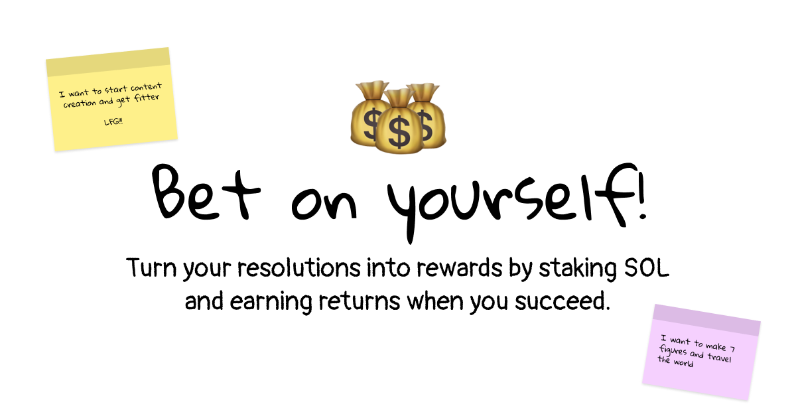

# reSOLution

Turn your New Year's resolutions into rewarding achievements by staking SOL! reSOLution is a web3 application built on Solana that helps you commit to your goals while earning staking rewards.

## Overview

reSOLution combines personal accountability with financial incentives. When you create a resolution, you stake SOL tokens which are delegated to Solana validators. This creates a dual benefit:
- Your stake serves as motivation to complete your goals
- Your tokens earn staking rewards while locked

### How It Works

1. **Create a Resolution**: Set your goal and choose a timeframe
2. **Stake SOL**: Lock your SOL tokens as commitment
3. **Select Verifiers**: Choose three trusted individuals to verify your completion
4. **Complete Your Goal**: Work towards your resolution
5. **Get Verified**: Have your verifiers confirm your success
6. **Claim Rewards**: Upon successful completion, receive your initial stake plus all earned rewards

If you don't complete your resolution by the deadline, your initial stake is returned, but the accumulated rewards are burned.

## Technical Stack

- **Frontend**: Next.js, TailwindCSS, shadcn/ui, React Query, TypeScript
- **Blockchain**: Solana

## License

This project is licensed under the MIT License - see the [LICENSE](LICENSE) file for details.